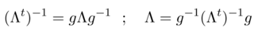
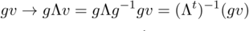

# Relatività generale - ripasso

## Richiami di relatività ristretta

- Postulato di Einstein
- Intervallo
    - invarianza intervallo: dimostrazione Landau
- Classificazione intervalli
- Tempo proprio (dilatazione dei tempi)
- Trasformazioni di Lorentz
    - achtung: sono trasformazioni lineari!
    - i boost lungo una direzione in particolare sono un gruppo a un parametro
        - lungo una direzione generica un gruppo a 3 parametri
- Trasformazioni delle velocità
    - si ricavano usando Lorentz per i differenziali
- Formalismo 4-D
    - invarianza prodotto di quadrivettori
    - covarianti e controvarianti
    - quadritensori
        - T00 è un triscalare
        - T0i è Ti0 sono trivettori
        - Tij è un tritensore
    - tensore unità e tensore metrico
        - Lorentz invarianza
    - tensore unità completamente antisimmetrico
    - quadrigradiente -> è covariante
    - le matrici di Lorentz sono anche il jacobiano della trasformazione (bella forza, sono lineari)
    - i vettori covarianti trasformano con l'inversa (è l'inverso del jacobiano, basta pensare come trasformano i differenziali e il quadrigradiente)
        - se pensati come vettori colonna con l'inversa della trasposta, perchè in realtà sono vettori riga (si pensi al prodotto scalare che deve rimanere invariante)
        

            
    - l'elemento di quadrivolume è invariante sotto Lorentz
        - perchè il Jacobiano della trasformazione è 1
    - teoremi di Gauss e Stokes
- quadrivelocità e quadriimpulso
    - modulo e componenti
        - *mass shell*
    - limiti classico e ultrarelativistico
        - particelle a massa nulla

### Teoria dei campi

- minima azione
    - lagrangiana e densità lagrangiana
- particella libera
    - unica quantità invariante che descrive il moto di una particella
    - limite classico
    - variazione e equazioni del moto

#### Elettrodinamica
- quadripotenziale
    - relazione con i campi
    - invarianza di gauge
- moto di una carica
    - lagrangiana di interazione con il campo
    - variazione ed equazioni *(achtung: variabili dinamiche, ora sono le coordinate!)*
    - tensore dei campi
        - forza di Lorentz e potenza dissipata
- equazioni omogenee di Maxwell
    - commutazione derivate (equivalente a considerare la divergenza di un rotore e il rotore di un gradiente)
- equazioni non omogenee di Maxwell
    - lagrangiana dei campi
    - quadricorrente (flusso di densità di carica)
        - la quadricorrente è un quadrivettore
        - eq. di continuità in forma covariante
    - lagrangiana d'interazione in termini di quadricorrente
    - variazione ed equazioni *(achtung: variabili dinamiche, ora sono le componenti del potenziale!)*

#### Tensore energia-impulso
- parallelo con quadricorrente
    - lui è un flusso di impulso
        - impulso prende il posto della carica
- modello a polvere *ferma*
    - densità di massa
    - forma covariante
- fluido perfetto
    - densità di energia
    - principio di Pascal
        - modulo del quadrimpulso e traccia positiva
        - bound sulla pressione        
    - forma covariante
- materia
    - fredda -> limite non relativistico (E~m, p<<m)
        - modello a polvere
    - calda -> limite ultrarelativistico (E~p)
        - fluido perfetto
    - fredda è la materia ordinaria, calda la radiazione

