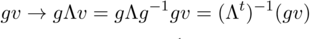

# Relatività generale - ripasso

## Richiami di relatività ristretta

- Postulato di Einstein
- Intervallo
    - invarianza intervallo: dimostrazione Landau
- Classificazione intervalli
- Tempo proprio (dilatazione dei tempi)
- Trasformazioni di Lorentz
    - achtung: sono trasformazioni lineari!
    - i boost lungo una direzione in particolare sono un gruppo a un parametro
        - lungo una direzione generica un gruppo a 3 parametri
- Trasformazioni delle velocità
    - si ricavano usando Lorentz per i differenziali
- Formalismo 4-D
    - invarianza prodotto di quadrivettori
    - covarianti e controvarianti
    - quadritensori
        - T<sup>00</sup> è un triscalare
        - T<sup>0i</sup> è T<sup>i0</sup> sono trivettori
        - T<sup>ij</sup> è un tritensore
    - tensore unità e tensore metrico
        - Lorentz invarianza
    - tensore unità completamente antisimmetrico
    - quadrigradiente -> è covariante
    - le matrici di Lorentz sono anche il jacobiano della trasformazione (bella forza, sono lineari)
    - i vettori covarianti trasformano con l'inversa (è l'inverso del jacobiano, basta pensare come trasformano i differenziali e il quadrigradiente)
        - se pensati come vettori colonna con l'inversa della trasposta, perchè in realtà sono vettori riga (si pensi al prodotto scalare che deve rimanere invariante)
        

            
    - l'elemento di quadrivolume è invariante sotto Lorentz
        - perchè il Jacobiano della trasformazione è 1
    - teoremi di Gauss e Stokes
- quadrivelocità e quadriimpulso
    - modulo e componenti
        - *mass shell*
    - limiti classico e ultrarelativistico
        - particelle a massa nulla

### Teoria dei campi

- minima azione
    - lagrangiana e densità lagrangiana
- particella libera
    - unica quantità invariante che descrive il moto di una particella
    - limite classico
    - variazione e equazioni del moto

#### Elettrodinamica
- quadripotenziale
    - relazione con i campi
    - invarianza di gauge
- moto di una carica
    - lagrangiana di interazione con il campo
    - variazione ed equazioni *(achtung: variabili dinamiche, ora sono le coordinate!)*
    - tensore dei campi
        - forza di Lorentz e potenza dissipata
- equazioni omogenee di Maxwell
    - commutazione derivate (equivalente a considerare la divergenza di un rotore e il rotore di un gradiente)
- equazioni non omogenee di Maxwell
    - lagrangiana dei campi
    - quadricorrente (flusso di densità di carica)
        - la quadricorrente è un quadrivettore
        - eq. di continuità in forma covariante
    - lagrangiana d'interazione in termini di quadricorrente
    - variazione ed equazioni *(achtung: variabili dinamiche, ora sono le componenti del potenziale!)*

#### Tensore energia-impulso
- parallelo con quadricorrente
    - lui è un flusso di impulso
        - impulso prende il posto della carica
- modello a polvere *ferma*
    - densità di massa
    - forma covariante
- fluido perfetto
    - densità di energia
    - principio di Pascal
        - modulo del quadrimpulso e traccia positiva
        - bound sulla pressione        
    - forma covariante
- materia
    - fredda -> limite non relativistico (E~m, p<<m)
        - modello a polvere
    - calda -> limite ultrarelativistico (E~p)
        - fluido perfetto
    - fredda è la materia ordinaria, calda la radiazione

## Campo gravitazionale

- principio di equivalenza
    - sistemi non inerziali hanno in generale campi che non si annullano all'infinito
    - i campi dei sistemi non inerziali possono essere annullati con un cambio di coordinate
        - i campi dei gravi no
- definizione della metrica
    - leggi di trasformazione dell'intervallo infinitesimo ds
    - wlog la si può considerare simmetrica (si pensi a definizione)
    - in generale non può essere ricondotta in forma inerziale con un cambio di coordinate (si pensi ai gradi di libertà)
        - è sempre possibile diagonalizzarla in un punto dato!
        - il determinante della metrica g è uguale a -J<sup>-2</sup>, dove J è il jacobiano della trasformazione che porta la metrica in forma galileiana
            - g < 0
- le trasformazioni della teoria sono i diffeomorifismi (trasformazioni generalizzate)
    - quadrivettori covarianti e controvarianti trasformano con il jacobiano
        - il prototipo sono i differenziali delle coordinate
            - NON le coordinate
    - il quadritensore unità è sempre il solito
        - le sue componenti sono invarianti per trasformazioni generalizzate
    - il tensore metrico standard è quello covariante
        - perchè i differenziali standard delle coordinate sono controvarianti
        - la versione controvariante è definita come l'inverso (quello che contratto con l'originale da l'identità)
    - gli indici si alzano e si abbassano con la metrica
    - il tensore unità completamente antisimmetrico non è più un tensore (neanche pseudo)
        - compare il jacobiano davanti ((-g)<sup>-1/2</sup>), che per trasformazioni di Lorentz è sempre 1
    - così anche per il differenziale di quadrivolume, quindi moltiplicando per l'inverso del jacobiano ottengo uno scalare per trasformazioni generalizzate

#### Principio di covarianza generale
- un'eq. è vera se:
    - è covariante rispetto alle trasformazioni generalizzate
    - ha il corretto limite per uno spazio-tempo piatto

*il senso di questo principio è che la relatività speciale è vera fino in fondo, perciò per un dato processo si può seguire l'evoluzione grazie al principio di equivalenza: intorno per intorno ci si riduce ad uno spazio-tempo piatto e si applicano le leggi note*

*perciò, se si hanno delle equazioni covarianti che sono vere per uno spazio-tempo piatto si ha che una loro soluzione in un riferimento fissato è anche una soluzione del procedimento precedente (risolvere intorno per intorno in spazi piatti), da cui il principio*

esempi: correlazione causale, intervalli luce

### Intervalli spazio-temporali
- tempo reale
    è quello misurato da un orologio fisico ancorato in un dato punto dello spazio
    - per ricondursi ad esso a partire da quello scandito dalla coordinata:
        - si prendono due eventi fissati in quel dato punto
        - se ne fa la differenza
        - si ricava l'intervallo e infine il tempo proprio (ds = dt, dove t è il tempo proprio)

si ottiene che g<sub>00</sub> > 0, se non lo fosse significa solo che il dato riferimento non può essere realizzato da un corpo fisico

- distanze spaziale
    - lancio un impulso EM, lo faccio rimbalzare e conto quanto tempo ci mette ad andare e tornare
        - la semisomma determina la distanza
        - risolvendo l'eq. si ottiene anche la merica spaziale dl<sup>2</sup>

    *non ha senso integrare dl, perché dipendendo dal tempo la distanza fra due punti dipenderebbe dalla linea d'universo scelta per l'integrazione* perché la metrica può dipendere dalla coordinata temporale
    in un riferimento stazionario la metrica non dipende dalla coordinata temporale, e quindi si può anche integrare e anche le distanze finite son ben definite


- simultaneità
    sono simultanei due eventi in un dato riferimento, altrimenti non ha senso (a meno che non siano lo stesso evento). definizione:
    - si parte da un punto e si arriva in un altro (avanti e indietro nel tempo)
    - si prende il punto medio tra partenza e arrivo come simultaneo al giro di boa

in questo modo intorno per intorno riesco a sincronizzare i miei orologi, e spostandomi lungo dei cammini posso portare la sincronizzazione in ogni punto dello spazio, **però**: se faccio una linea chiusa trovo che la partenza non è simultanea a se stessa, assurdo
- non posso sincronizzare univocamente in generale
    - dipende dal percorso che seguo
- però con una metrica statica posso farlo
    - ogni metrica si può ricondurre a statica con le trasformazioni generalizzate
    - la simultaneità non è un problema dovuto ai campi, ma ai riferimenti balordi

### Derivazione covariante
I differenziali dei quadrivettori sono differenze tra funzioni valutate in punti differenti, che perciò trasformano in modo differente: **il differenziale di un quadrivettore non è in generale un quadrivettore**
- fissato il primo vettore nel primo punto si identifica un corrispondente (covariante) del secondo vettore, sempre nel primo punto: **trasporto parallelo**
    - in tal modo la differenza fra i due è covariante
    - in un riferimento galileiano i vettori devono essere invarianti per trasporto parallelo (le loro componenti)
- sviluppando questa differenza si trova che oltre al differenziale ordinario vi è un altro termine
    - il nuovo differenziale è il **differenziale covariante**
    - il termine aggiuntivo è composto dal quadrivettore, il differenziale delle coordinate e i **simboli di Christoffel**
    - si ottengono in questo modo anche i differenziali covarianti di tensori generici (covarianti, controvarianti e misti)
        - per gli scalari non c'è differenza fra differenziali ordinari e covarianti, pocihé rimangono invariati per trasporto parallelo
        (a sua volta determinato dal fatto che rimangono invariati per trasformazioni generalizzate, si pensi alla definizione)
- simboli di Christoffel
    - sono simmetrici negli indici inferiori
    - non sono dei tensori
    - dipende solo dalla metrica e le sue derivate prime
- differenziale del determinante della metrica
- teorema di Gauss covariante generale

### Particella in campo gravitazionale
- equazioni
    - dal principio di covarianza generale
        - si ottengono le **geodetiche**
        - la quadriforza dipende dai simboli di Christoffel (e dalla quadrivelocità)
            - la metrica svolge il ruolo di potenziale del campo gravitazionale
            - coerente col principio di equivalenza: posso sempre annullare la forza in un intorno dato
    - dal principio di minima azione
    achtung: stavolta deve variare anche la metrica (ma le variabili dinamiche sono solo le coordinate)
- limite basse velocità
    implica che anche il campo deve essere debole
    - la lagrangiana coincide con quella usuale in meccanica classica

#### Campo gravitazionale costante
cioè la metrica è indipendente dalla coordinata x<sub>0</sub>, cioè è stazionaria
- per più corpi non può esservi una metrica stazionaria: moto generato per attrazione gravitazionale
- se, in una metrica stazionaria, traslo nella coordinata x<sub>0</sub> due eventi simultanei e vicini spazialmene, troverò altri due eventi ancora simultanei
    - il tempo fisico però può tranquillamente scorrere in modo diverso nei due punti dello spazio -> *redshift gravitazionale*
        - in una metrica stazionaria il tempo x<sub>0</sub> di viaggio impiegato da un segnale dipende solo dal percorso che effettua (non dall'x<sub>0</sub> a cui parte), quindi le differenze di tempo x<sub>0</sub> fra segnali consecutivi sono preservate, ma quindi non lo sono quelle di tempo fisico
        - spostamento della frequenza della radiazione EM
    - se il corpo che genera il campo è immobile non ci possono essere componenti anisotrope nella metrica (cioè le componenti miste con il tempo), perché i due versi del tempo sono identici -> metrica statica
        - dalle eq. del moto risulta che la componente 0 del quadriimpulso covariante è conservata
            - all'ordine più basso questa quantità è l'energia meccanica

    **achtung: in relatività generale gli indici si alzano e si abbassano con cautela!** (le quantità fisiche possono cambiare)

### Tensore energia-impulso
Assumendo una lagrangiana che al più è funzione di un campo e delle sue derivate prime e imponendo minima azione si ottengono le equazioni di Eulero-Lagrange con il campo al posto della coordinata come variabile dinamica

- per generalizzare l'azione si sostituisce l'elemento di quadrivolume, moltiplicandolo semplicemente per (-g)<sup>1/2</sup>, così da formare uno scalare: se la lagrangiana è uno scalare rispetto alle trasformazioni generalizzate l'azione è nuovamente uno scalare, con il giusto limite per lo spazio-tempo piatto

**achtung: prima di variare l'azione bisogna esprimere esplicitamente la metrica (ogni contrazione ne sottointende una!)**
essa va variata nella variazione dell'azione, anche se in generale non costituisce una variabile dinamica (a meno che non si voglia trovare le equazioni di Einstein)

- si ottengono di nuovo le eq. di Eulero-Lagrange, ma stavolta la lagrangiana compare moltiplicata per (-g)<sup>1/2</sup> all'interno delle derivate

Si può ricavare il tensore energia-impulso per una lagrangiana arbitraria
- si ha che la derivata covariante del tensore energia-impulso è nulla
```
    - si esegue una trasformazione delle coordinate sommando una quantità piccola
    - si ricava l'azione nelle nuove coordinate (ovviamente al prim'ordine)
        - la lagrangiana è uno scalare rispetto a trasformazioni generalizzate, quindi non varia nel passaggio alle nuove coordinate
    - si trova la variazione rispetto all'azione nelle coordinate originali (*è una variazione puramente formale, non rispetto alle variabili dinamiche*)
        - si impongono le equazioni del moto
        - si impone che la variazione sia nulla, infatti anche l'azione è invariante per trasformazioni generalizzate
    - a questo punto si definisce il tensore energia-impulso in modo naturale
        - non è nullo perché la variazione arbitraria non è quella delle coordinate, ma del termine additivo
    - si esprime la variazione della metrica in funzione di quella del termine additivo
    - si integra per parti con Gauss covariante
     *si tenga di conto che la derivata covariante della metrica è nulla*
```
la definizione del tensore energia-impulso è buona finché la lagrangiana non dipende dalle derivate della metrica
- questo però non porta a un quadriimpulso conservato
    - infatti, mentre tutte le cose covarianti funzionano bene anche con le nuove derivate, il teorema di Gauss non prevede trasporti di vettori e si applica alle derivate ordinarie
